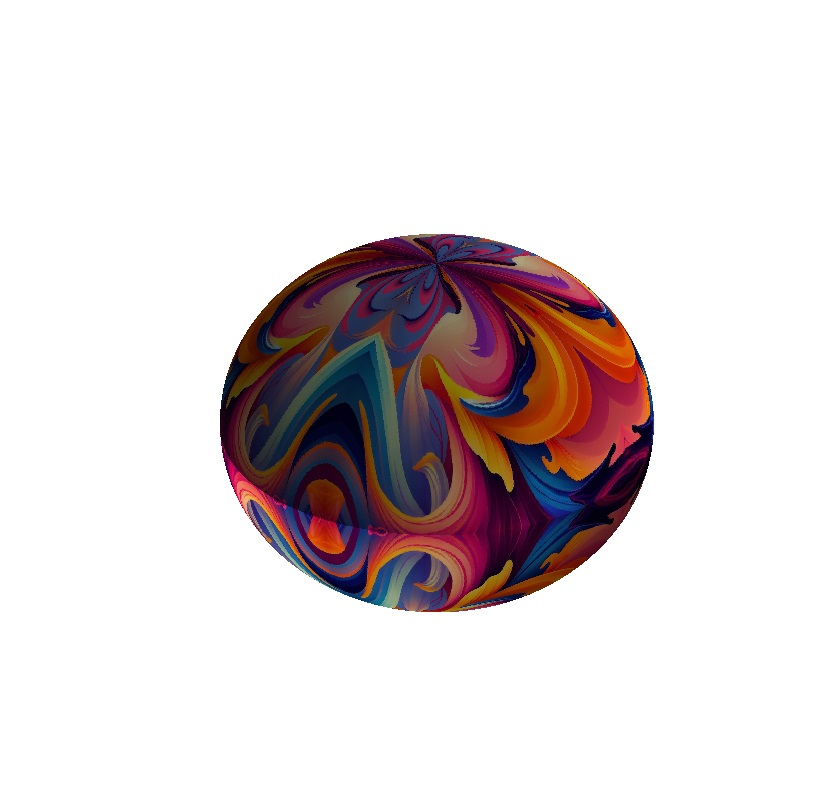

# Soccer Ball Creator

A Python-based tool for generating 3D soccer ball designs using custom image textures. This project maps an image to a sphere, divides it into triangular sections, and mirrors the textures to create a soccer ball-like design.
The idea came from observing a soccer ball design and realizing that mirroring one-quarter of a triangular space effectively could result in a visually appealing ball. With a well-designed triangular image, the result can look great, although the project is still very incomplete.

-It can be slow; try changing the pixel setting.
-The projection distorts the image, this needs fixing.

## Features
- Interactive 3D visualization of the soccer ball.

## Prerequisites
To run the project, you need the following:
- Python 3.8 or later
- The following Python libraries:
  - `numpy`
  - `matplotlib`
  - `Pillow`

You can install the required libraries using:
```bash
pip install numpy matplotlib pillow
```

## Usage
1. Clone the repository:
   ```bash
   git clone https://github.com/your-username/soccer-ball-creator.git
   cd soccer-ball-creator
   ```

2. Run the script:
   ```bash
   python soccer_ball_creator.py
   ```

3. Provide an image file as input. For example:
   ```python
   main("path_to_your_image.png")
   ```

4. Interact with the 3D soccer ball visualization using the sliders to adjust azimuth and elevation.

## How It Works
1. **Input Image**: The script accepts an image and extracts the triangular region from it.
2. **Mirrored Textures**: The triangular region is resized and mirrored to fit sides * 2 sections of the sphere.
3. **3D Sphere Mapping**: The texture is mapped onto a 3D sphere to create a soccer ball design.
4. **Interactive Visualization**: Users can rotate and view the ball interactively.

## Example
### Input Image


### Generated Soccer Ball


## Contribution
Contributions are welcome! Please fork the repository, create a feature branch, and submit a pull request.

## License
This project is licensed under the MIT License. See the `LICENSE` file for details.

## Acknowledgments
- Inspired by creative soccer ball designs.
- Special thanks to the open-source community for the libraries used in this project.

# soccer_ball_creator
 
