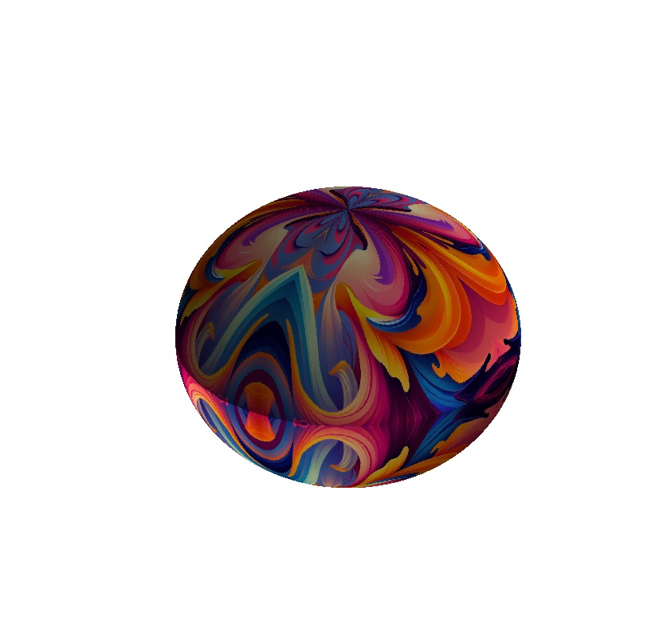

# Soccer Ball Creator

Map any image onto a 3D soccer-ball surface — drop an image on the left, see it tiled around an interactive sphere on the right.

**Live:** https://abobabo91.github.io/soccer_ball_creator/

Pure client-side HTML + WebGL — drop an image, pan/zoom the source, orbit the ball with mouse drag, tweak `Sides` and `Hemisphere Mirror`. No server, no build.
